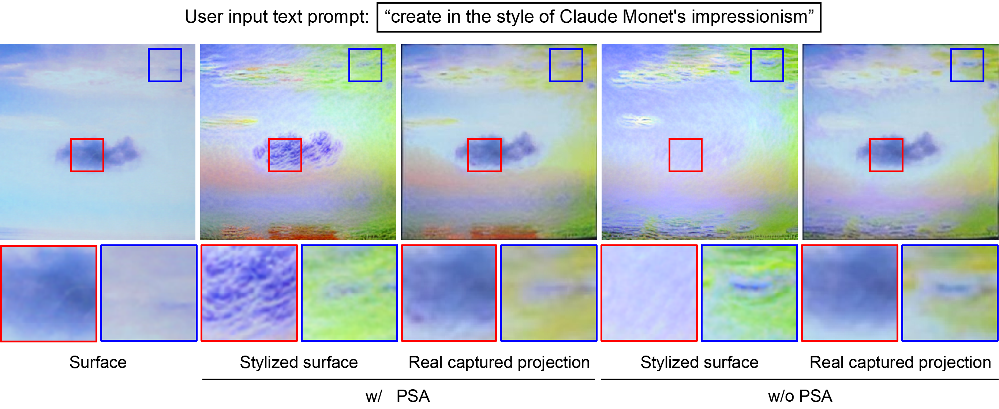

# LAPIG: Language Guided Projector Image Generation with Surface Adaptation and Stylization [IEEE TVCG/VR'25]

<p align="center">
  
</p>

<p align="center">
  <a href="https://Yu-chen-Deng.github.io/LAPIG">Project Page</a>
  |
  <a href="https://drive.google.com/file/d/1bYIzrCclHubtezsrzZF4EslR30Avq2GQ/view?usp=sharing
  ">Data</a>
</p>


## Introduction

PyTorch's implementation of LAPIG.


## Prerequisites
* PyTorch compatible GPU
* Conda (Python 3.10.4)

## Usage

#### Apply LAPIG to your own setup

1. Create a new conda environment:
   ```
   conda env create -f environment.yaml
   activate LAPIG       # Windows
   conda activate LAPIG # Linux
   ```
2. Clone this repo:
   ```
   git clone https://github.com/Yu-chen-Deng/LAPIG
   cd LAPIG
   ```

3. Download LAPIG [sampling images (~109.7 MB)][8] and extract to [`data/CMP/`](data/CMP/), the file like this:
   ```
   data/CMP
    |
    |_ /prj
    |
    |_ /desired
   ```
4. Start **visdom** by typing the following command in local or server command line:
   `visdom -port 8097`
5. Once **visdom** is successfully started, visit [`http://localhost:8097`](http://localhost:8097) (train locally) or `http://server:8097` (train remotely).
6. Open [`run_LAPIG.py`](run_LAPIG.py) and set which GPUs to use. An example is shown below, we use GPU 0.
   `os.environ['CUDA_VISIBLE_DEVICES'] = '0'`
7. Build setup and modify `surface` in `config.yaml`:
   ```
   procams:
      surface: 'test' # MODIFY 'test'
   ```
8. Run [`run_LAPIG.py`](run_LAPIG.py) to reproduce benchmark results. To visualize the training process in **visdom** (slower), you need to set `plot_on=True`.
   ```
   python run_LAPIG.py
   ```


## Citation

If you use the dataset or this code, please consider citing our work:

```
@ARTICLE{Deng2025LAPIG,
  author  = {Deng, Yuchen and Ling, Haibin and Huang, Bingyao},
  journal = {IEEE Transactions on Visualization and Computer Graphics},
  title   = {LAPIG: Language Guided Projector Image Generation with Surface Adaptation and Stylization},
  year    = {2025},
  doi     = {10.1109/TVCG.2025.3549859}}
}
```

## Acknowledgments

- This code borrows heavily from
  - [InstructPix2Pix][2] for **Language Guided Style Transfer (LGST)**.
  - [SPAA][5] and [CompenNeSt++][4] for **PCNet/CompenNeSt++**.
  - [DiffMorph][3] for surface stylization morphing effects.
  - [cheind/py-thin-plate-spline][6] for `pytorch_tps.py`.
  - [Po-Hsun-Su/pytorch-ssim][7] for PyTorch implementation of SSIM loss.
- We thank the anonymous reviewers for valuable and inspiring comments and suggestions.
- We thank the authors of the colorful textured sampling images.
- Feel free to open an issue if you have any questions/suggestions/concerns 😁.

## License

This software is available free of charge for non-commercial, non-profit use and may be redistributed under the terms specified in [license](LICENSE).

[2]: https://github.com/timothybrooks/instruct-pix2pix
[3]: https://github.com/volotat/DiffMorph
[4]: https://github.com/BingyaoHuang/CompenNeSt-plusplus
[5]: https://github.com/BingyaoHuang/SPAA
[6]: https://github.com/cheind/py-thin-plate-spline
[7]: https://github.com/Po-Hsun-Su/pytorch-ssim
[8]: https://drive.google.com/file/d/1bYIzrCclHubtezsrzZF4EslR30Avq2GQ/view?usp=sharing
